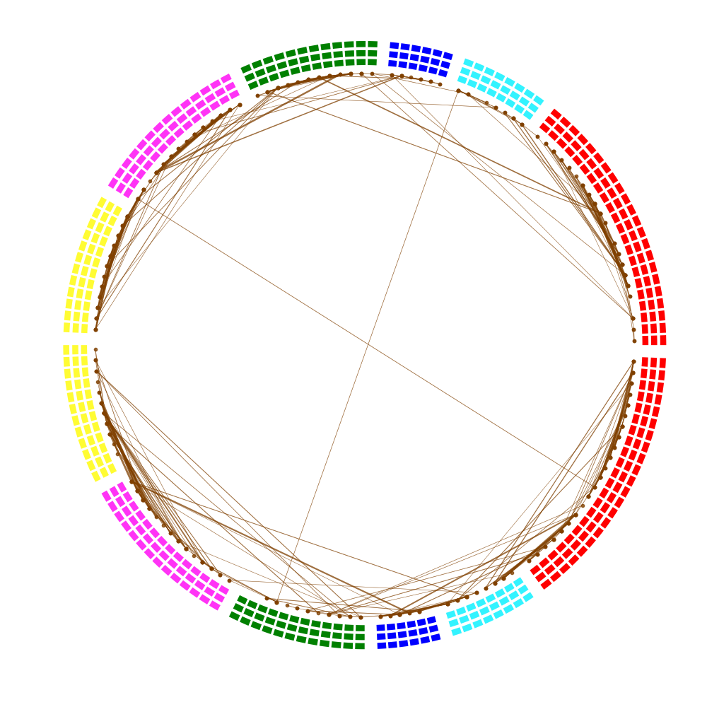

# Circle Plot for Brain Network Visualization

## Input:
The interface to the user is the `plot_circle` function which takes two mandatory and three optional input.
* Mandatory Input
  * edges: list of edges(links) between nodes to be plotted. Each edges is a 3-tuple (source_index, destination_index, weight)
  * color_list_face: It's a list of `C` rings. Each ring is a list of `N` colors for the faces of the boxes.
* Optional Input
  * color_list_edge: It's a list of `C` rings. Each ring is a list of `N` colors for boundary of the boxes.
  * save: saves the plot if `True`
  * fname: filename where the plot is saved.

## Output:

